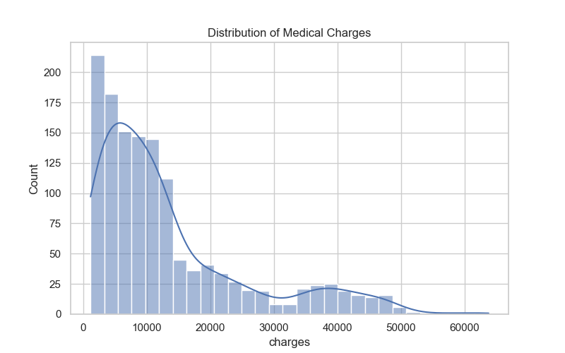
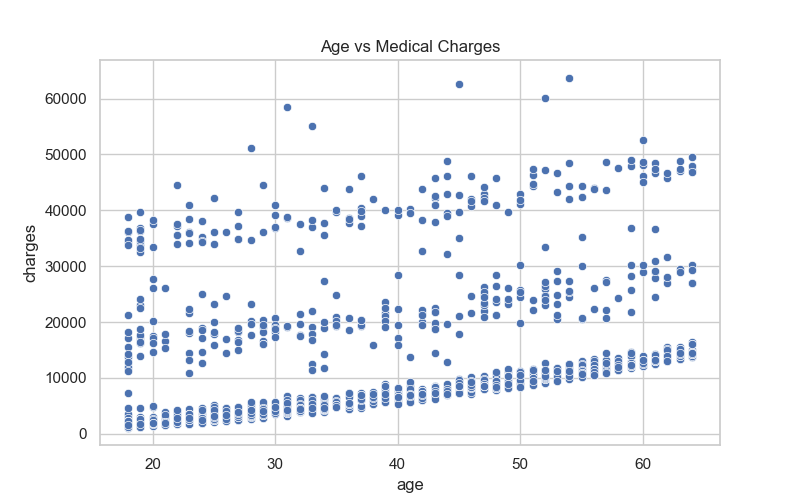

# Healthcare Risk Analysis

## Project Overview

This project analyzes structured healthcare data to identify key risk factors influencing medical expenses. Using Python and SQL, the dataset is cleaned, explored, and transformed into actionable insights.

The goal is to demonstrate an end-to-end data analytics workflow including preprocessing, exploratory data analysis, visualization, and KPI extraction.

---

## Dataset

Medical Cost Personal Dataset  
Source: Kaggle  
https://www.kaggle.com/datasets/mirichoi0218/insurance

The dataset contains demographic and medical attributes such as age, BMI, smoking status, region, and healthcare charges.

---

## Tools & Technologies

- Python (Pandas, NumPy, Matplotlib, Seaborn)
- SQLite (SQL queries)
- Jupyter/Python scripting
- Data visualization

---

## Project Workflow

1. Data loading and cleaning
2. Exploratory data analysis (EDA)
3. Visualization and insight generation
4. SQL database creation
5. KPI extraction using SQL

---

## Key Insights

- Smokers incur significantly higher healthcare costs
- Medical expenses increase with age
- Higher BMI is associated with increased charges
- Regional variations exist in healthcare spending

---

## Visualizations

### Distribution of Charges

### Smoking vs Charges

### Age vs Charges

---

## Project Structure

